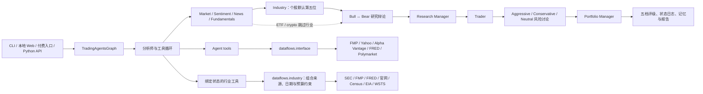

# TradingAgents 学习与二次开发指南

> 适用版本：`tradingagents 0.3.1`。初稿依据 `a33fd4c` 源码和 `.ua/knowledge-graph.json` 整理；2026-09-21 按当前工作区补齐行业与产业链分析师的流程、配置和接入说明。既有图谱未为该新增角色重建，新增模块以源码为准。

## 1. 先认识项目

TradingAgents 是一个基于 LangGraph 的多智能体金融研究框架。它把真实交易团队拆成多个 LLM 角色：分析师先收集和解释数据，多空研究员展开辩论，交易员形成交易提案，风险团队继续质询，最后由 Portfolio Manager 给出五档评级与最终决策。

这个项目更适合用于研究多智能体协作、金融数据接入和 LLM 工作流，不应把输出直接视为投资建议。结果还会受模型、采样、数据时点和外部服务状态影响。

核心技术：

- Python 3.10+，README 推荐 Python 3.12。
- LangGraph 负责有状态工作流和条件路由。
- LangChain 负责模型、消息、工具和 structured output 接口。
- Typer + Rich 提供交互式 CLI。
- FMP、Yahoo Finance、Alpha Vantage、FRED、Polymarket 等提供外部数据；行业模块另组合 SEC、公司官网和 Census/EIA/WSTS 官方文件。
- Pydantic schema 约束关键决策型 Agent 的输出。
- SQLite checkpointer、Markdown memory log 和报告树负责不同层次的持久化。

### 1.1 一次分析的主流程



分析师阶段按所选顺序串行执行。每个分析师都可能在“LLM 节点 → ToolNode → LLM 节点”之间循环，直到模型不再请求工具。研究辩论和风险讨论由条件路由控制轮次。

新股票分析默认顺序为市场、情绪、新闻、基本面、行业与产业链；ETF 跳过行业，crypto 同时跳过基本面。标的身份确定后统一过滤有效角色集合，进度、执行和 checkpoint 使用同一集合。行业节点先强制取得上下文和指标证据，无核心披露时直接降级，不让模型自行补写。

## 2. 如何安装和运行

### 2.1 本地开发环境

推荐用独立虚拟环境进行可编辑安装：

```bash
conda create -n tradingagents python=3.12
conda activate tradingagents

# 普通使用
pip install .

# 二次开发：可编辑安装并包含现有开发工具
pip install -e ".[dev]"
```

`pyproject.toml` 是依赖和工具配置的唯一主要清单；根目录 `requirements.txt` 只包含 `.`，用于兼容传统安装流程。

配置 API Key：

```bash
cp .env.example .env
```

至少配置所选 LLM provider 的 Key，例如：

```dotenv
OPENAI_API_KEY=...
# 或 GOOGLE_API_KEY / ANTHROPIC_API_KEY / XAI_API_KEY 等
```

默认市场数据使用 yfinance，不需要 Key。切换到 Alpha Vantage 时再配置：

```dotenv
ALPHA_VANTAGE_API_KEY=...
```

项目包导入时会从当前工作目录向上寻找 `.env` 和 `.env.enterprise`。已经由 shell 导出的环境变量优先，不会被文件中的同名值覆盖。

### 2.2 交互式 CLI

安装后运行：

```bash
tradingagents
```

从源码直接运行：

```bash
python -m cli.main
```

CLI 会依次询问标的、分析日期、分析师、研究深度、LLM provider、模型和输出语言，并实时展示 Agent 状态、消息、工具调用和 token 统计。

启用断点恢复前先查看当前安装版本的选项：

```bash
tradingagents --help
```

当前源码把 `--checkpoint/--no-checkpoint` 与 `--clear-checkpoints` 定义在唯一的分析命令上。在 Typer 单命令模式下可直接运行：

```bash
tradingagents --checkpoint
tradingagents --clear-checkpoints
```

常见 ticker：

- 美股：`AAPL`、`NVDA`。
- 港股：`0700.HK`；日股：`7203.T`；A 股：`600519.SS`。
- 加密资产：`BTC-USD`、`ETH-USD`，CLI 会自动识别资产类型。

### 2.3 Python API

最小调用：

```python
from tradingagents.default_config import DEFAULT_CONFIG
from tradingagents.graph.trading_graph import TradingAgentsGraph

config = DEFAULT_CONFIG.copy()
config["llm_provider"] = "openai"
config["quick_think_llm"] = "gpt-5.4-mini"
config["deep_think_llm"] = "gpt-5.5"
config["output_language"] = "Chinese"

graph = TradingAgentsGraph(
    selected_analysts=("market", "social", "news", "fundamentals", "industry"),
    debug=False,
    config=config,
)

final_state, decision = graph.propagate("NVDA", "2026-01-15")
print(decision)

report_path = graph.save_reports(final_state, "NVDA")
print(report_path)
```

省略 `selected_analysts` 也会使用这五位。显式传入旧四角色列表会保持四角色，不自动追加；在 CLI/Web 中可取消行业角色。上述历史日期会排除无历史版本的当前行业文件。行业来源配置及 SEC 联系方式见[部署说明](付费报告部署与运行.md#35-行业与产业链分析配置)。

调用加密资产时显式传入资产类型：

```python
final_state, decision = graph.propagate(
    "BTC-USD",
    "2026-01-15",
    asset_type="crypto",
)
```

注意：`DEFAULT_CONFIG.copy()` 是浅拷贝，适合覆盖字符串、整数等顶层值。如果要修改 `data_vendors`、`tool_vendors`、`benchmark_map` 等嵌套字典，或原地修改 `industry_sources` 列表，应使用深拷贝，避免意外修改共享默认值：

```python
from copy import deepcopy

config = deepcopy(DEFAULT_CONFIG)
config["data_vendors"]["core_stock_apis"] = "yfinance,alpha_vantage"
```

### 2.4 Docker

使用远程 LLM provider：

```bash
cp .env.example .env
docker compose run --rm tradingagents
```

使用本地 Ollama：

```bash
docker compose --profile ollama run --rm tradingagents-ollama
```

当前工作区的容器启动方式有两个重要细节：

- `docker-entrypoint.sh` 先修复 `/home/appuser/.tradingagents` 持久化卷权限，再通过 `gosu` 降权为 `appuser` 执行 CLI。
- Compose 将本地 `./reports` 绑定到容器的 `/home/appuser/app/reports`，便于直接取回报告。

### 2.5 输出文件在哪里

默认配置使用 `~/.tradingagents`：

```text
~/.tradingagents/
├── cache/                         # 数据缓存、按 ticker 划分的 SQLite checkpoint
├── logs/                          # Python API 的状态日志和默认报告目录
└── memory/
    └── trading_memory.md          # 跨运行交易记忆与事后反思
```

可用以下变量改写路径：

- `TRADINGAGENTS_RESULTS_DIR`
- `TRADINGAGENTS_CACHE_DIR`
- `TRADINGAGENTS_MEMORY_LOG_PATH`

CLI 运行时还会创建按 ticker 和分析日期分组的消息、工具日志与中间报告，并在结束时询问是否额外保存完整报告树。

## 3. 项目结构

```text
TradingAgents/
├── main.py                         # 最小 Python API 示例
├── pyproject.toml                  # 包、依赖、CLI、pytest、Ruff 配置
├── cli/                            # Typer/Rich 交互入口
│   ├── main.py                     # CLI 主流程、实时 UI、运行与报告保存
│   ├── utils.py                    # 交互选择、provider/model/key 解析
│   ├── models.py                   # 分析师与资产类型枚举
│   └── stats_handler.py            # LLM/tool 调用统计
├── tradingagents/
│   ├── default_config.py           # 默认配置和 TRADINGAGENTS_* 覆写
│   ├── reporting.py                # 分层 Markdown 报告树
│   ├── graph/                      # LangGraph 图、状态传播、路由与恢复
│   │   ├── trading_graph.py        # 核心门面
│   │   ├── setup.py                # 节点和边装配
│   │   ├── conditional_logic.py    # 条件路由
│   │   ├── propagation.py          # 初始状态和调用参数
│   │   └── checkpointer.py         # SQLite checkpoint
│   ├── agents/                     # 角色实现和 Agent 共享契约
│   │   ├── analysts/               # 技术、情绪、新闻、基本面、行业与产业链分析
│   │   ├── researchers/            # Bull / Bear
│   │   ├── managers/               # Research / Portfolio Manager
│   │   ├── trader/                 # Trader
│   │   ├── risk_mgmt/              # 三种风险立场
│   │   ├── schemas.py              # 结构化输出 schema 与 Markdown render
│   │   └── utils/                  # AgentState、工具、记忆、结构化降级
│   ├── dataflows/                  # 外部金融数据适配与统一路由
│   │   ├── interface.py            # 方法 → 类别 → vendor 的统一门面
│   │   ├── config.py               # 数据层运行配置
│   │   ├── y_finance.py            # Yahoo Finance
│   │   ├── alpha_vantage*.py       # Alpha Vantage 适配器族
│   │   ├── fred.py                 # 宏观数据
│   │   ├── industry/               # 行业披露、官方统计文件、传输与证据组合
│   │   ├── polymarket.py           # 预测市场
│   │   └── symbol_utils.py         # 跨市场标的规范化
│   └── llm_clients/                # 多模型供应商适配
│       ├── factory.py               # provider 工厂
│       ├── base_client.py           # 统一契约
│       ├── openai_client.py         # OpenAI 与兼容 provider 注册表
│       ├── capabilities.py          # 模型能力声明
│       └── model_catalog.py         # CLI 模型目录
├── tests/                           # 现有契约与回归测试
├── scripts/                         # 结构化输出、SEC/行业来源冒烟验证
├── Dockerfile
├── docker-compose.yml
└── .github/workflows/ci.yml
```

### 3.1 九个架构层

| 层 | 主要职责 | 关键入口 |
|---|---|---|
| 命令行交互层 | 收集运行参数、实时展示进度、保存报告 | `cli/main.py`、`cli/utils.py` |
| LangGraph 编排层 | 初始化图、连接节点、路由、传播、检查点 | `graph/trading_graph.py`、`graph/setup.py` |
| 多智能体业务层 | 分析、辩论、交易、风险与组合决策 | `agents/`、`agents/schemas.py` |
| 金融数据接入层 | vendor 选择、异常语义、数据清洗和防前视 | `dataflows/interface.py` |
| LLM 适配层 | provider 工厂、模型能力、凭据和参数兼容 | `llm_clients/factory.py` |
| 应用入口与配置层 | Python 示例、默认配置、环境模板和包配置 | `main.py`、`default_config.py` |
| 测试与验证层 | 保护图结构、数据契约、provider 与持久化 | `tests/`、`scripts/` |
| 容器与 CI/CD | 镜像、服务编排、卷权限和质量门禁 | `Dockerfile`、Compose、CI |
| 项目文档层 | 使用说明、变更历史与协作上下文 | `README.md`、`CHANGELOG.md` |

## 4. 核心运行机制

### 4.1 配置如何生效

`tradingagents/default_config.py` 是默认配置源，并在模块导入时处理 `TRADINGAGENTS_*` 环境变量。常用项包括：

| 配置 | 作用 |
|---|---|
| `llm_provider` | LLM provider，如 openai、google、anthropic、ollama |
| `quick_think_llm` | 分析师、研究员、Trader 等快速任务模型 |
| `deep_think_llm` | Research/Portfolio Manager 等复杂决策模型 |
| `backend_url` | 自定义或 OpenAI-compatible endpoint |
| `max_debate_rounds` | 多空研究辩论轮次 |
| `max_risk_discuss_rounds` | 三方风险讨论轮次 |
| `checkpoint_enabled` | 是否启用 LangGraph checkpoint |
| `output_language` | 面向用户报告语言；内部辩论仍以英文为主 |
| `data_vendors` | 各数据类别的 vendor 链 |
| `tool_vendors` | 单个工具的 vendor 覆盖，优先级更高 |
| `industry_sources` | 行业独立来源组合；默认 sec/fmp/fred/company_ir/census/eia/wsts，不是回退链 |
| `industry_max_related_companies` | 本轮关联公司数量上限，整数 0–3；0 不展开关联公司 |

优先级可以理解为：

1. 代码中的默认值。
2. 已导出的环境变量和 `.env` 中的 `TRADINGAGENTS_*` 覆写。
3. 调用方传给 `TradingAgentsGraph` 的配置。
4. CLI 中明确作出的交互选择；研究轮次等部分配置会保留显式环境变量优先级，checkpoint flag 则在明确给出时优先。

数据 vendor 字符串本身就是精确回退链，例如：

```python
config["data_vendors"]["news_data"] = "yfinance,alpha_vantage"
```

代码不会偷偷追加未配置的 vendor；`default` 才表示使用该方法所有已注册实现。

行业模块使用 `industry_sources` 独立组合，不能用原有 vendor 选择器关闭它的 FMP/SEC 等来源。这两个行业配置当前没有环境变量映射；`SEC_USER_AGENT`、`FMP_API_KEY`、`FRED_API_KEY` 则由运行环境提供。

### 4.2 AgentState 是工作流契约

`tradingagents/agents/utils/agent_states.py` 定义了三组状态：

- `AgentState`：标的、资产类型、日期、消息、五类分析报告（含 `industry_report`）、行业本轮 ID、研究计划、交易方案和最终决策。
- `InvestDebateState`：Bull/Bear 历史、当前回答、Research Manager 裁决和轮次计数。
- `RiskDebateState`：三种风险立场的历史、最近发言者、Portfolio Manager 裁决和轮次计数。

`Propagator.create_initial_state()` 必须为流程需要的状态提供初值。新增字段时只改 TypedDict 不够，还要同步：

- 初始状态；
- 写入字段的 Agent；
- 读取字段的后续 Agent；
- CLI 实时展示和报告保存（如果是用户可见内容）；
- checkpoint 图形签名（如果字段会改变图结构或恢复语义）。

### 4.3 GraphSetup 如何连接节点

`GraphSetup.setup_graph()` 的顺序是：

1. 根据 `AnalystExecutionPlan` 添加所选分析师、清消息节点和 ToolNode。
2. 分析师有 tool call 时进入对应 ToolNode，然后回到分析师；没有 tool call 时进入清消息节点。
3. 最后一位分析师完成后进入 Bull Researcher。
4. Bull/Bear 按轮次往返，由 Research Manager 裁决。
5. Trader 形成交易提案。
6. Aggressive、Conservative、Neutral 依次讨论风险。
7. Portfolio Manager 输出最终决策，图到达 `END`。

路由器返回的每个字符串都必须存在于 `path_map`。修改节点显示名、兼容旧命名或新增分支时，必须同步 `DEBATE_PATH_MAP`、`RISK_ANALYSIS_PATH_MAP` 和相应测试，否则图会在运行中崩溃。

### 4.4 structured output 与降级

Research Manager、Trader、Portfolio Manager 和 Sentiment Analyst 使用 Pydantic schema 约束关键输出。共同模式在 `agents/utils/structured.py`：

1. 创建 Agent 时调用 `with_structured_output(Schema)`。
2. 成功时把 Pydantic 对象渲染成稳定 Markdown。
3. provider 不支持 schema，或调用阶段返回无效结果时，记录 warning 并回退到普通文本调用。

所以修改结构化决策不能只改 prompt，还应同时维护：

- `agents/schemas.py` 中的字段、校验器与枚举；
- 对应的 `render_*` 函数；
- 最终评级解析 `agents/utils/rating.py`；
- 使用该 schema 的 Agent；
- 现有 structured output 冒烟与回归测试。

### 4.5 三种持久化不要混淆

| 类型 | 文件 | 生命周期 | 目的 |
|---|---|---|---|
| Checkpoint | `cache/checkpoints/<TICKER>.db` | 单次未完成运行 | 崩溃后从最后成功节点恢复 |
| Trading memory | `memory/trading_memory.md` | 跨运行长期存在 | 保存决策、实现收益和反思 |
| Reports/logs | `logs/` 或指定目录 | 每次运行产物 | 审计状态、阅读各团队报告 |

成功完成分析后，对应 checkpoint 会自动清除。交易记忆则先保存 pending 决策；同 ticker 后续运行时获取真实收益并补写反思。

### 4.6 行业角色的证据与降级

`industry_analyst.py` 与 `industry_data_tools.py` 展示了一种先取证据再生成报告的工具循环。`get_industry_context`、`get_industry_indicators` 是必需采集；`get_related_company_evidence` 按需取得最多三家公司的披露，只允许一层。工具通过 `InjectedState` 绑定主标的和日期，状态参数不暴露给模型；恢复时从工具消息恢复已使用的关联预算和来源拒绝状态。

`dataflows/industry/` 中，`documents.py` 处理 SEC/官网披露和定位提取，`indicators.py` 处理明确的行业指标映射及 CSV/XLSX，`transport.py` 处理有界下载、缓存和 SEC 请求约束，`IndustryResearch` 组合证据与逐源失败。只启用 SEC 时也可按 SEC ticker/CIK 映射核验关联公司。不要把 FMP 同行候选或匿名客户自动变成已知供应链关系。

历史分析按披露时间选择 SEC 申报，FRED 使用历史版本；当前 FMP 拆分、官网和官方统计文件没有历史可用性依据时直接排除。核心披露全缺时不调用模型，报告只说明证据不足；部分源失败保留其他证据。报告校验发现截断、无依据数字条件、未提供的引用 URL 或 WSTS 金额问题时最多修订一次，仍失败或修订请求报错则生成来源资料摘要：直接展示披露摘录、原始指标、日期、原文定位和来源链接，并明确具体失败原因，不采用被拒绝的模型草稿。这不是完整行业判断或全量事实核查。诊断进入 `industry_report_validation` 日志和节点消息元数据，行业检查点版本为 `v2`。

行业报告直接传给多空研究员、三位风控分析师和研究/最终决策经理，输出到 `1_analysts/industry.md` 及完整报告。旧状态缺少该字段时按空值兼容。完整职责和五个问题见[架构说明](付费报告系统架构.md#33-行业与产业链分析)，公开数据探测与模型验收见[验证报告](行业分析数据源接入验证.md)。

## 5. 二次开发的推荐方式

先遵守三条边界：

1. Agent 负责“如何思考和调用哪些工具”，不直接实现 vendor HTTP 细节。
2. `dataflows` 负责外部数据协议、清洗、时间边界和异常，统一通过 `interface.py` 暴露。
3. `llm_clients` 负责模型 SDK 差异，业务 Agent 只依赖统一 LangChain ChatModel 行为。

### 5.1 新增一个分析师

假设要增加 `Macro Analyst`，建议按以下顺序修改：

1. 在 `tradingagents/agents/analysts/` 新建 factory，沿用 `create_market_analyst()` 的闭包节点模式。
2. 在 `AgentState` 增加 `macro_report`，并在 `Propagator.create_initial_state()` 初始化。
3. 在 `agents/__init__.py` 暴露 factory。
4. 在 `graph/analyst_execution.py` 的 `ANALYST_NODE_SPECS` 注册 key、Agent 节点、清消息节点、ToolNode 和 report key。
5. 在 `TradingAgentsGraph._create_tool_nodes()` 注册 Macro Analyst 可执行的工具集合。
6. 在 `GraphSetup.setup_graph()` 的 `analyst_factories` 注册 factory。
7. 在 `ConditionalLogic` 增加对应 `should_continue_<key>`，返回值必须与执行计划节点名一致。
8. 在 `cli/models.py`、`cli/utils.py` 和 `cli/main.py` 更新可选项、固定顺序、状态展示与报告映射。
9. 同步 `application/runner.py` 的角色顺序、报告/进度映射，以及 `web/app.py`、`reporting.py` 的展示和输出；付费入口通过默认角色集合生成新订单，并在 `commerce/profile.py` 保存需要复现的非密钥配置。
10. 明确资产适用范围，在身份确定后统一过滤，并在新节点/工具防御性检查；默认增加角色不能改写旧任务显式列表。
11. 如果新的选择或配置改变执行语义，确认 `TradingAgentsGraph._run_signature()` 隔离不兼容 checkpoint；同时让旧状态缺字段时可读取。
12. 明确下游消费者，按需要接入研究/风控/经理上下文；复用 `tests/test_analyst_execution.py`、`tests/test_reporting.py`、`tests/test_checkpoint_resume.py`、`tests/test_i18n_coverage.py` 等现有测试验证契约。

最容易漏的是 CLI 展示映射和 checkpoint 图形签名，而不是 Agent prompt 本身。

### 5.2 新增一个数据 vendor

如果新 vendor 为现有方法提供另一套实现：

1. 在 `tradingagents/dataflows/` 新建适配器，输入输出与现有同类实现保持一致。
2. 将认证缺失、限流、无数据分别转换为 `VendorNotConfiguredError`、`VendorRateLimitError`、`NoMarketDataError`，不要用同一个宽泛异常掩盖语义。
3. 在 `dataflows/interface.py` 的 `VENDOR_METHODS` 为目标方法注册实现；必要时同步 `VENDOR_LIST`。
4. 在 `DEFAULT_CONFIG["data_vendors"]` 给出合理默认值，或让用户显式配置精确 vendor 链。
5. 如果需要 API Key，同步 `.env.example`。
6. 复用 `tests/test_vendor_routing.py`、`tests/test_vendor_errors.py` 和相邻 vendor 测试。

如果还要新增一种工具能力：

1. 同步 `TOOLS_CATEGORIES` 和 `VENDOR_METHODS`。
2. 在 `agents/utils/*_data_tools.py` 增加 LangChain `@tool` 包装。
3. 把 tool 放入 `TradingAgentsGraph._create_tool_nodes()` 中正确的分析师 ToolNode。
4. 更新 Agent prompt，确保参数名与 tool schema 完全一致。

需要格外关注日期边界和前视偏差。历史分析必须过滤分析日期之后的财报、新闻和行情；不要因为 vendor 返回“最新数据”就直接交给 Agent。

### 5.3 新增一个 LLM provider

先判断 API 类型：

- OpenAI-compatible：优先在 `OPENAI_COMPATIBLE_PROVIDERS` 添加一条 `ProviderSpec`，复用 `OpenAIClient`。
- 真正不同的原生 API：实现新的 `BaseLLMClient` 子类，并在 `factory.py` 增加延迟导入分支。

然后同步：

1. `llm_clients/api_key_env.py` 的 Key 映射；无 Key 的本地 provider 用 `None`。
2. `llm_clients/model_catalog.py` 的模型选项；模型变化频繁时只提供 Custom model ID。
3. `llm_clients/capabilities.py` 的 structured output、reasoning 和 tool choice 能力。
4. `cli/utils.py` 的 provider 选择与 endpoint 交互。
5. `.env.example` 和相关回归测试。

不要在 Agent 中写 `if provider == ...`。provider 差异应收敛在客户端和能力注册表中。

### 5.4 改变交易流程或决策结构

修改图结构时：

- 在 `graph/setup.py` 修改节点和边。
- 在 `graph/conditional_logic.py` 修改分支条件。
- 在 `agent_states.py` 与 `propagation.py` 修改状态契约。
- 如果图形输入发生变化，更新 `_run_signature()`，防止错误恢复旧 checkpoint。
- 保持所有路由结果都有 path map，并复用风险路由与 checkpoint 测试。

修改最终决策字段或评级时：

- 先改 schema 和 renderer，再改 Agent prompt。
- 同步 `rating.py` 与 `signal_processing.py`。
- 检查 memory log、CLI 展示和报告树是否仍能消费新格式。

## 6. 关键文件地图

| 文件 | 什么时候读/改 |
|---|---|
| `tradingagents/graph/trading_graph.py` | 理解完整初始化和运行；改全局组件或生命周期 |
| `tradingagents/graph/setup.py` | 新增角色、阶段或改变执行顺序 |
| `tradingagents/agents/utils/agent_states.py` | 新增跨节点传递的数据 |
| `tradingagents/graph/conditional_logic.py` | 改工具循环、辩论轮次或分支 |
| `tradingagents/agents/schemas.py` | 改研究、交易、组合与情绪输出契约 |
| `tradingagents/agents/utils/agent_utils.py` | 改 Agent 共用上下文、语言与工具入口 |
| `tradingagents/agents/analysts/industry_analyst.py`、`tradingagents/agents/utils/industry_data_tools.py` | 行业职责、强制采集、输出校验、状态与关联预算 |
| `tradingagents/dataflows/industry/` | SEC/官网提取、行业指标、官方文件解析、来源降级与缓存 |
| `tradingagents/dataflows/interface.py` | 新增工具方法、vendor 或回退行为 |
| `tradingagents/dataflows/config.py` | 理解嵌套 vendor 配置如何合并和隔离 |
| `tradingagents/llm_clients/factory.py` | 新增原生 provider 或改变创建路径 |
| `tradingagents/llm_clients/openai_client.py` | 处理 OpenAI-compatible provider 差异 |
| `tradingagents/default_config.py` | 新增全局配置和环境变量覆写 |
| `cli/main.py` | 改交互流程、进度 UI、日志和报告提示 |
| `tradingagents/reporting.py` | 改磁盘报告结构 |

## 7. 复杂度热点与风险

知识图谱中以下区域复杂度和影响面较高：

- `cli/main.py`：交互、实时 UI、图执行、状态追踪、日志和报告都集中在一个文件；改动时优先做局部修改。
- `graph/trading_graph.py`：连接配置、LLM、工具、图、记忆、checkpoint 和结果持久化，是最高风险核心门面。
- `agents/utils/agent_utils.py`：大量 Agent 依赖的公共入口，高 fan-in；修改函数签名要先查所有调用方。
- `agents/schemas.py`：字段变化会传导到多个决策 Agent、renderer、报告和测试。
- `dataflows/interface.py`：vendor 回退与异常策略的统一门面，错误处理变化可能影响所有数据工具。
- `dataflows/y_finance.py`、`stockstats_utils.py`、`reddit.py`、`fred.py`：外部协议、缓存、日期和容错交织，必须重点防止前视偏差和陈旧数据。
- `llm_clients/openai_client.py`：多 provider、多模型能力和 Responses/Chat Completions 差异集中，新增条件前先检查能力注册表是否已经能表达。
- `agents/utils/memory.py`：文件持久化、幂等更新、收益解析和轮转同时存在，改格式要考虑旧日志兼容。

建议先在外围增加一个适配器或 Agent，再通过注册表接入；不要一开始就改核心门面来塞入特例。

## 8. 验证改动

项目现有质量门禁包括 pytest 与 Ruff。按改动范围选择验证：

```bash
# 无需导入依赖即可先检查 Python 语法
python -m compileall tradingagents cli

# 安装 dev 依赖后
ruff check .
pytest -q
```

更快的定向验证：

```bash
# 图结构与恢复
pytest -q tests/test_analyst_execution.py tests/test_risk_router_path_map.py
pytest -q tests/test_checkpoint_resume.py

# 结构化输出
pytest -q tests/test_structured_agents.py tests/test_structured_agent_prompts.py
python scripts/smoke_structured_output.py

# 数据 vendor
pytest -q tests/test_vendor_routing.py tests/test_vendor_errors.py

# LLM provider
pytest -q tests/test_provider_registry.py tests/test_capabilities.py

# 持久化和报告
pytest -q tests/test_memory_log.py tests/test_reporting.py
```

项目协作约定要求优先复用现有测试；除非需求明确，不要仅为改动新建单元测试文件，也不要引入新的测试依赖。对需要外部 API 的验证，应使用项目已有 mock/fixture 或明确标记的 integration 流程，避免在普通单测中真实请求服务。

## 9. 推荐学习顺序

第一次阅读不需要逐个看完 150 个文件，按下面顺序建立心智模型：

1. `README.md`：知道项目解决什么问题、如何运行。
2. `main.py` 与 `default_config.py`：跑通最小 Python 调用。
3. `agent_states.py` 与 `propagation.py`：理解全图交换的数据。
4. `trading_graph.py` 与 `setup.py`：看完整图如何初始化和连接。
5. 五个 analyst：对比“读状态 → 组 prompt → 调工具 → 写报告”的共同模式；行业角色额外要求先取得核心披露，并限制关联研究范围。
6. Bull/Bear、Research Manager、Trader、风险团队和 Portfolio Manager：理解决策如何逐级收敛。
7. `schemas.py` 与 `structured.py`：理解关键 Agent 的稳定输出契约。
8. `dataflows/interface.py` 和一个具体 vendor：理解数据路由边界。
9. `llm_clients/factory.py` 和 `openai_client.py`：理解多模型适配。
10. `memory.py`、`checkpointer.py`、`reporting.py`：区分三种持久化。
11. `cli/main.py`：最后再看 UI 如何把以上能力串起来。
12. 选择一个小扩展实践，例如新增一个只复用现有工具的分析师，完成从状态到图注册再到定向验证的闭环。

生成的完整知识图谱位于 `.ua/knowledge-graph.json`，其中包含 665 个节点、1,292 条关系、9 个架构层和 13 步 guided tour，可继续用于按文件或依赖关系探索代码。
