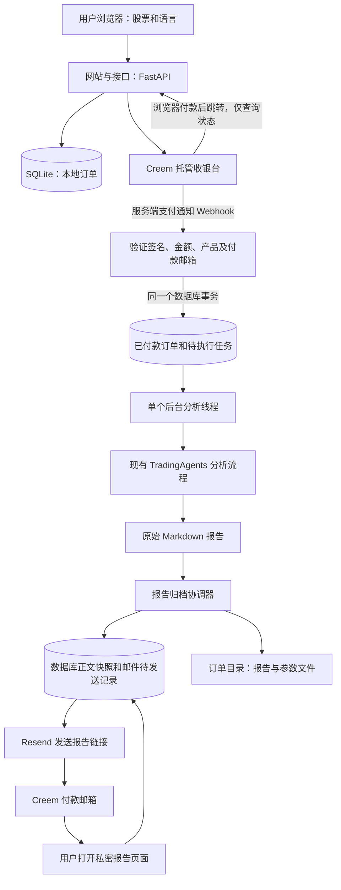
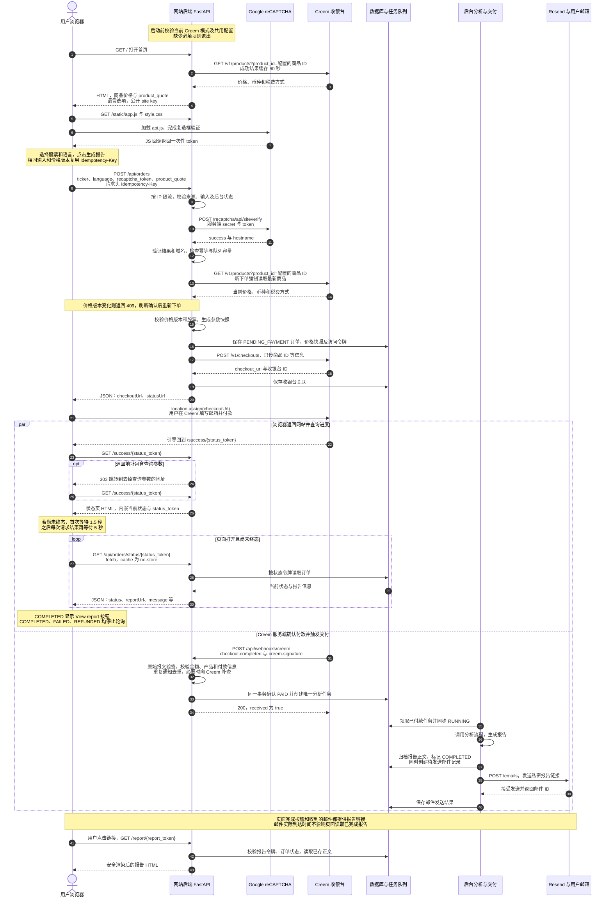

# 付费股票报告系统架构

本文根据当前仓库实现整理，更新于 2026-09-18。安装和操作步骤见[部署与运行文档](付费报告部署与运行.md)。

快速定位：[总体架构](#2-总体架构) · [代码分层](#3-代码分层) · [数据源适配](#31-行情与证券资料适配) · [购买流程](#4-一次购买的完整流程) · [完整用户时序](#45-完整用户时序与前端调用) · [数据模型](#6-数据模型) · [报告保存](#8-报告持久保存) · [接口](#9-对外接口)。

## 1. 系统用途与技术选择

用户在首页选择美股代码和报告语言，在 Creem 托管收银台填写邮箱并付款。后端确认付款后，使用现有 TradingAgents 在后台生成分析报告，保存报告，再把私密链接发到付款邮箱。

第一版只有一个一次性产品，价格、币种和税费方式从所选环境的 Creem 商品读取，不含账号、登录、订阅、积分、钱包、用户中心或自动交易。访客不能自行指定模型、服务地址、提示词、分析深度或价格。

“后台执行”表示用户不必一直打开网页等待；当前每次只执行一个分析任务。

| 技术或服务 | 用途 |
| --- | --- |
| Python | 复用项目现有分析代码；当前 Docker 镜像使用 Python 3.12 |
| FastAPI / Uvicorn | 网页、创建订单、支付通知和状态查询接口 |
| Jinja2 / HTML / CSS / JavaScript | 服务端生成网页，浏览器提交表单及轮询进度；无需独立前端构建工程 |
| LangGraph / LangChain | 复用多智能体分析、工具调用和模型接入 |
| Marketstack / Yahoo / Alpha Vantage | 按配置提供行情；Marketstack、Yahoo 还提供统一证券资料，新闻和基本面另走独立路由 |
| SQLite | 订单、分析任务、事件、支付通知处理记录及邮件发送记录 |
| 本地持久化磁盘 | 报告文件、分析缓存和日志 |
| Creem | 收银台、付款信息和支付/退款通知 |
| Resend | 发送与订单相关的通知邮件 |

付费链路没有引入 Redis 队列、Kafka、RabbitMQ、独立数据库服务器或微服务拆分。

## 2. 总体架构



对外只有一个 Web 服务进程。进程内运行 HTTP 接口、一个分析线程和一个报告归档/邮件协调线程；不需要额外启动队列服务器。

## 3. 代码分层

| 层次 | 主要文件或目录 | 职责 |
| --- | --- | --- |
| 启动与运维 | `tradingagents/mvp/cli.py` | 启动网站；离线查询、导出、备份及人工邮件重试 |
| 网页与接口 | `tradingagents/mvp/app.py` | 路由、请求校验、限流、原始报文验签和报告渲染 |
| 页面资源 | `tradingagents/mvp/templates/`、`tradingagents/mvp/static/` | 首页、状态页、报告页、条款和隐私页 |
| 商业配置 | `tradingagents/commerce/config.py` | 域名、支付、邮件、队列阈值及语言列表 |
| 产品参数 | `tradingagents/commerce/profile.py` | 校验股票、限制公开输入、生成分析参数快照 |
| 支付适配 | `tradingagents/commerce/creem.py` | 调用 Creem，验证付款与退款信息 |
| 商业协调 | `tradingagents/commerce/service.py` | 创建收银台、处理通知、关联任务及管理后台线程 |
| 商业存储 | `tradingagents/commerce/store.py` | 订单事务、报告归档、邮件待发送记录和恢复处理 |
| 邮件适配 | `tradingagents/commerce/email.py` | 构造邮件并调用 Resend |
| 现有任务机制 | `tradingagents/application/task_store.py`、`tradingagents/application/task_manager.py` | SQLite 队列、领取任务、执行及保存事件 |
| 现有分析入口 | `tradingagents/application/runner.py` | `AnalysisRequest` 描述请求，`AnalysisRunner` 执行并产生结果 |
| 数据源路由与适配 | `tradingagents/dataflows/interface.py`、`market_data.py` | 沿用供应商注册表及配置，统一结构化行情、证券资料和缓存 |
| 数据供应商与指标 | `tradingagents/dataflows/fmp.py`、`marketstack.py`、`yahoo.py`、`alpha_vantage_stock.py`、`indicators.py` | 供应商请求与字段映射、本地 stockstats 指标计算 |
| 现有分析核心 | `tradingagents/graph/`、`tradingagents/agents/`、`tradingagents/dataflows/`、`tradingagents/llm_clients/` | 分析编排、智能体、金融数据及模型调用 |
| 现有报告输出 | `tradingagents/reporting.py` | 生成完整 Markdown 报告和分章节文件 |

支付和订单逻辑在 `commerce`，页面在 `mvp`。分析核心不需要了解付款邮箱或 Creem。现有任务存储增加了共享数据库事务的能力，使“订单确认付款”和“分析任务入队”可以一起提交。

`tradingagents` 是原有命令行工具，`tradingagents-web` 是本地 Streamlit 工作台，`tradingagents-mvp` 才是付费网站入口。它们有不同用途，公开部署时只发布付费网站。

### 3.1 行情与证券资料适配

沿用 `data_vendors`、`tool_vendors` 和函数注册表，不引入额外插件框架。`market_data.py` 提供两个结构化入口：`get_ohlcv(symbol, start_date, end_date)` 返回统一 DataFrame；`get_instrument_info(symbol)` 返回证券代码、实际供应商、名称、类型、交易所、国家、币种和可选行业。Agent 工具仍使用原有名称和参数，在工具出口转换为 CSV 或文本。

| 消费方 | 数据路径 | 配置 |
| --- | --- | --- |
| 行情工具、行情校验、股票及基准收益复盘 | `get_ohlcv` → FMP / Yahoo / Marketstack / Alpha Vantage | `core_stock_apis`，工具级 `get_stock_data` 覆盖优先 |
| 本地技术指标 | `indicators.py` → 五年 OHLCV → stockstats | `technical_indicators=local`，行情使用上述路由 |
| 分析前公司身份、下单前股票资格 | `get_instrument_info` → FMP / Yahoo / Marketstack | `instrument_data`，同名工具覆盖优先 |
| 新闻、基本面及内部人交易 | FMP / Yahoo / Alpha Vantage 的独立工具路径 | `fundamental_data`、`news_data`，工具级覆盖优先 |

默认值按入口区分：本地 CLI/Web 和通用 `DEFAULT_CONFIG` 的行情、指标、资料、基本面、新闻仍为 `yfinance`；付费服务初始化自己的配置副本时，指标用 `local`，其余四项用 `fmp`。环境变量覆盖入口默认值；显式 `CommerceService(base_config=...)` 完整尊重调用方配置。`local` 使用配置行情源，原有 `yfinance` 指标明确使用 Yahoo 行情。仅按显式供应商链回退，单独选择 FMP/Marketstack 不尝试 Yahoo。缺少 FMP Key 会阻止默认付费入口的购买校验。配置步骤见[部署文档](付费报告部署与运行.md#34-fmp-数据源配置与回滚)。

FMP 使用固定版本 `fmpsdk==20260824.0` 的 `Client`，密钥只从 `FMP_API_KEY` 读取，客户端按需创建。SDK 重试关闭，适配器统一最多重试两次临时错误；鉴权、套餐权限及额度耗尽不重试。SDK 异常和 HTTP 200 错误对象转为项目异常，日志只记录本地定义的供应商、方法名、状态、行数与耗时，不转发响应正文或原始 URL。

FMP 日线把 dividend-adjusted 接口的 OHLC 与 non-split-adjusted 接口的原始成交量按准确代码及日期合并；任一侧缺失都报不可用。证券资料通过 profile 的 ETF、基金及活跃交易标记和交易所映射识别类型，缺少标记不猜股票类型；国家表示上市国家，美国上市 ADR 不按总部国家排除。

基本面由当前 profile、quote、TTM ratios/key metrics 组合，字段语义不一致时不强行替换，缺失项标为 `N/A`。历史日期不返回当前概览。财报支持年度和季度，保留财务期间、币种及披露日期，排除披露日晚于截止日或无可验证披露日期的记录；不承诺历史重述版本。新闻做分页、日期过滤和去重，全球新闻使用综合新闻接口，`global_news_queries` 仅用于 Yahoo。内部人交易保留最新最多 100 条的语义，显示交易与披露日期，不作为历史时点接口。

Marketstack 使用现有 `requests` 调用 V2 `/eod` 和 `/tickers/{symbol}`，日线完整翻页，单页最多 1,000 条。统一区间包含起止交易日，排序去重并过滤分析截止日之后的行情；OHLC 使用复权字段，Volume 保留原始成交量。复权字段缺失、空数据、最新有效区间收盘价缺失或行情过期会报不可用，不替换成未复权价格。临时限流、连接/超时和服务端错误最多重试两次；鉴权、套餐权限错误和月额度耗尽不重复重试。

指标窗口以分析截止日向前取五年。行情缓存按供应商、实际证券代码、日期范围和价格口径隔离；覆盖所需区间的缓存可供工具、指标、校验及复盘复用，保留当日缓存刷新机制。证券资料缓存按供应商和代码区分，下单校验强制刷新。Yahoo 专用别名留在 Yahoo 路径，Marketstack 和 FMP 各自转换 `BRK.B` / `BRK-B` 等美股类别标点，不按名称近似匹配；例如 `GOLD` 不会在 FMP/Marketstack 路径变成黄金期货。

分析身份查询失败可退化为仅使用 ticker；购买资格校验必须确认 `EQUITY`、美国上市交易所及国家，缺失或失败即拒绝下单，ETF 只供行情和基准使用。商业入口将自己的 `base_config` 显式传给购买校验，避免受上一分析任务的进程级配置影响。订单快照保存 `data_vendors` 和 `tool_vendors`；付款入队和运行沿用快照，密钥仅来自运行环境。一般分析的 checkpoint 签名也包含供应商配置，切换数据源后不会复用原供应商的续跑状态；付费任务仍关闭 checkpoint。

Yahoo SDK 直接调用仅保留在 `yahoo.py`、`y_finance.py`、`yfinance_news.py`，用于本地默认、显式选择或旧订单快照。FMP 覆盖当前这些数据分类；Marketstack 仍只覆盖行情和证券资料。宏观、预测市场、社交来源保留原路由。FMP SDK 代码许可证不授予数据商业展示权，上线需核对合同、实际接口权限并完成[真实接口验收](付费报告部署与运行.md#113-fmp-真实接口验收)。

## 4. 一次购买的完整流程

### 4.1 创建本地订单和收银台

1. 后端读取 Creem 商品，成功结果缓存 60 秒。首页展示价格、币种和税费说明，并嵌入商品价格版本 `product_quote`。
2. 首页提交 `ticker`（股票）、`language`（报告语言）、`recaptcha_token`（一次性人机验证令牌）和 `product_quote`，同时携带 `Idempotency-Key` 请求标识。
3. 必要配置在服务启动时校验，缺失则拒绝启动。下单时后端先按 IP 限流，再向 Google 验证 reCAPTCHA v2 令牌及域名；验证失败或不可用时拒绝下单。随后检查输入、幂等标识及队列容量，重新读取 Creem 商品；页面价格版本已过期时返回 409，要求刷新确认。商品读取失败或股票资格无法确认时，不进入收款步骤。
4. 使用商业服务自身配置查询证券资料，通过股票资格校验后，保存状态为 `PENDING_PAYMENT` 的订单、金额/币种/税费方式快照、模型和分析参数快照（含供应商选择），以及两个独立随机令牌。
5. 后端按商品 ID 创建 Creem 收银台，不传价格覆盖值。本地订单 ID 写入 `request_id`，也放入 `metadata.order_id`。
6. 浏览器跳转收银台，邮箱由 Creem 收集。

同一浏览器会话的相同股票、语言和价格版本会复用请求标识；验证码令牌不参与幂等标识计算、不存入会话或订单，每次重试需重新验证。`product_quote` 只用于发现页面价格过期，金额始终取自后端查询；API 兼容未携带该字段的调用，仍使用 Creem 当前商品信息。若创建收银台超时，远端可能已经创建成功，本地标记 `UNKNOWN`；重试不会盲目再次创建远端收银台，需要人工核对。

### 4.2 验证支付并入队

1. Creem 请求 `POST /api/webhooks/creem`。Webhook 是支付平台主动发给后端的通知。
2. 接口对原始请求体验证 `creem-signature`，验证通过后才解析通知。
3. 对 `checkout.completed`，根据 `request_id` 找本地订单，校验收银台、产品、环境、一次性付款类型、数量、付款状态、金额及客户关系；对象不完整时通过商户 API 查询。
4. 从验证过的 Creem Customer 对象取得交付邮箱。
5. 在同一个 SQLite 事务中写入支付信息、通知处理记录和唯一分析任务。提交前，后台线程看不到新任务。

实付、应付和币种必须与订单快照一致：`inclusive` 产品的总额等于保存的售价；`exclusive` 产品的总额等于保存的售价加上 Creem 确认的税费。税费必须是非负整数；若返回税前小计，也核验它与总额、税费的关系。后续修改商品价格不会改变历史订单的核验标准。浏览器传入的价格、邮箱或“支付成功”标志不能授权交付。

原始报文验签及事件格式参见 [Creem 官方 Webhook 文档](https://docs.creem.io/code/webhooks)；本项目的具体校验及入队逻辑以仓库实现为准。

### 4.3 后台分析

`AnalysisTaskManager` 从 `runs` 表领取一个任务，通过 `CommerceService.runner_factory()` 构造现有 `AnalysisRunner`。付款入队时使用订单的供应商配置规范化代码，执行时仍沿用该快照，不读取其他任务遗留的配置来重新选择数据源。

流程沿用原项目：市场/技术、舆情、新闻、基本面分析 → 多空研究讨论 → 研究结论 → 交易观点 → 风险讨论 → 最终决策。耗时受数据访问、模型速度、工具调用和重试影响。

### 4.4 先保存，再交付

任务完成后，协调器读取原始报告，保存订单归档文件和数据库正文快照。保存成功后才标记 `COMPLETED`，并在同一数据库事务中创建邮件待发送记录。

邮件线程随后发送私密报告链接。邮件失败不改变已经保存的报告，也不会重新运行分析。用户付款后关闭浏览器不影响后台流程；付款返回页只查询状态，不能确认付款或启动分析。

### 4.5 完整用户时序与前端调用

下面以配置完整、服务已启动、首次下单并成功生成报告为例。启动命令 `serve --mode test|prod` 从同一 `.env` 选择对应的 `CREEM_TEST_*` 或 `CREEM_PROD_*`；其他配置共用。浏览器栏包含用户在网页中的操作；数据库栏同时代表 SQLite 订单和任务队列，后台栏合并展示分析线程与交付协调线程。两个 `par` 分支可以同时进行：支付回调与浏览器返回网站的先后顺序不固定。



**前端实际发出的本站请求**如下。页面由后端模板生成，`app.js` 只有创建订单和查询状态两种业务 `fetch`，报告通过普通页面导航打开。

| 时机 | 请求 | 前端处理 |
| --- | --- | --- |
| 打开首页 | `GET /`、`GET /static/app.js`、`GET /static/style.css` | 展示 Creem 价格与表单；商品、后台或容量不可用时按钮关闭；可购买且启用验证码时加载 Google 验证组件 |
| 点击生成报告 | `POST /api/orders` | 发送 JSON 和幂等请求头；未完成验证时在页面提示，不发请求 |
| 创建订单成功 | 跳转返回的 `checkoutUrl` | 使用 `window.location.assign()` 打开 Creem；返回的 `statusUrl` 当前没有被 JS 用来发起跳转或轮询 |
| 付款后回站 | `GET /success/{status_token}` | Creem 使用后端创建收银台时配置的 `success_url` 引导返回；服务端把当前状态及令牌写入 HTML |
| 等待报告 | `GET /api/orders/status/{status_token}` | 首次延迟 1.5 秒，后续每次请求结束后间隔 5 秒；返回 `reportUrl` 时显示报告按钮，不自动跳转 |
| 点击报告按钮或邮件链接 | `GET /report/{report_token}` | 直接显示后端渲染的 HTML，不重复调用模型生成报告 |

例如，选择 AAPL 和简体中文时，创建订单的请求与响应如下，所有令牌和地址均为占位示例：

```http
POST /api/orders
Content-Type: application/json
Idempotency-Key: 6d3163b4-7281-4d03-9d43-e90b3e681123

{"ticker":"AAPL","language":"zh-CN","recaptcha_token":"一次性验证码令牌","product_quote":"首页嵌入的价格版本"}
```

```json
{
  "checkoutUrl": "https://checkout.creem.io/示例收银台地址",
  "statusUrl": "/success/STATUS_TOKEN"
}
```

报告完成时，状态查询接口的响应示例为：

```json
{
  "status": "COMPLETED",
  "ticker": "AAPL",
  "language": "zh-CN",
  "analysisDate": "2026-09-16",
  "reportUrl": "/report/REPORT_TOKEN",
  "message": null
}
```

`analysisDate` 取确认付款时的纽约当地日期；尚未付款时可以为 `null`。未完成时 `reportUrl` 为 `null`；失败时 `message` 为可公开的失败说明。

异常路径也由当前前端处理：下单遇到验证码无效或过期、网络或服务错误，会显示错误并重置验证码，重新验证后沿用相同股票、语言和价格版本对应的幂等标识。价格已变化时返回 409，提示刷新确认；刷新后使用新价格版本生成新的请求标识。下单返回 429 时按钮按 `Retry-After` 暂停重试，当前后端返回 60 秒；状态查询遇到 429 也延长轮询间隔，其他查询错误默认 5 秒后重试。到达状态页时已经处于终态，则无需启动轮询。

Google 的 `siteverify`、Creem 的 Webhook、报告分析和 Resend 发信都在服务端链路；前端既不携带这些服务的私钥，也不调用“确认付款”或“启动分析”接口。用户在付款后关闭页面只会停止该页面的轮询，后台仍继续执行。

对应实现：[前端请求与轮询](../tradingagents/mvp/static/app.js)、[HTTP 路由](../tradingagents/mvp/app.py)、[状态页模板](../tradingagents/mvp/templates/status.html)、[订单与后台协调](../tradingagents/commerce/service.py)。

## 5. 参数与语言规则

| 参数 | 付费产品规则 |
| --- | --- |
| 股票 | 美国交易所上市的股票；当前不销售 ETF、期货或加密货币报告 |
| 报告语言 | 访客选择，保存到订单和 `AnalysisRequest.output_language` |
| 分析日期 | 接受有效支付通知时的纽约当地日期；`paid_at` 另外保留支付对象中的时间 |
| 分析师 | 固定启用市场、舆情、新闻、基本面四类 |
| 研究深度 | 固定为 1，讨论深度由现有分析入口应用 |
| 模型和服务地址 | 来自服务器配置，访客不能修改 |
| 行情、指标及证券资料供应商 | 来自服务器的 `data_vendors` / `tool_vendors`，保存到订单快照；访客不能修改 |
| 断点续跑 | 付费任务固定关闭 |
| 模型重试次数 | 未配置时为 2，允许显式配置为 0 |
| 每次模型输出上限 | 未配置时为 8192 tokens；tokens 是模型文本用量的计量单位 |

语言代码：`en` 英语、`zh-CN` 简体中文、`ja` 日语、`ko` 韩语、`hi` 印地语、`es` 西班牙语、`pt` 葡萄牙语、`fr` 法语、`de` 德语、`ar` 阿拉伯语、`ru` 俄语。

所选语言传给分析提示词；报告外层网页、邮件文案和部分固定报告标题仍使用英文。这是报告语言选择，不是整站界面语言切换。

参数快照用于追溯当时的请求和允许保存的非密钥配置，不保存模型或数据源 API 密钥，也不保证将来重跑得到相同数据或文本。每次调用的 token 上限和重试上限不等于整份报告的费用硬上限。

## 6. 数据模型

所有表都在 `runs.sqlite3` 中。复用两张原有任务表，新增三张商业业务表。

| 表名 | 内容与约束 |
| --- | --- |
| `runs` | 分析请求、运行状态、结果路径、错误摘要；通过 `id` 与订单关联 |
| `run_events` | 分析进度与执行事件，通过 `run_id` 关联任务 |
| `trade_orders` | 订单、付款邮箱、支付关联、报告正文；请求标识、收银台 ID、支付订单 ID、交易 ID、任务 ID、令牌分别有唯一约束 |
| `webhook_events` | 事件 ID、报文摘要、处理结果及必要的订单关联；事件 ID 唯一，不保存完整原始通知报文 |
| `email_deliveries` | 固定邮件内容、尝试次数、下次时间和服务商消息 ID；同一订单、同一通知类型只有一条记录 |

`trade_orders` 的关键字段按用途分组如下：

| 字段组 | 主要字段 |
| --- | --- |
| 订单与请求 | `id` 本地订单号；`ticker` 股票；`language` 语言；`analysis_date` 日期；`params_json` 参数快照 |
| 产品快照 | `product_id` 产品 ID；`amount` Creem 返回的整数价格（如 USD 的美分）；`currency` 币种；`tax_mode` 含税/另计税费；`mode` 支付环境 |
| 支付 | `creem_checkout_id` 收银台 ID；`creem_order_id` 支付订单 ID；`creem_transaction_id` 交易 ID；`creem_customer_id` 客户 ID；`customer_email` 交付邮箱 |
| 执行 | `status` 订单状态；`trade_run_id` 分析任务 ID；`error_message` 用户可见的错误摘要 |
| 报告 | `report_token` 私密令牌；`report_path` 归档路径；`report_markdown` 正文；`report_sha256` 正文校验值 |
| 查询与去重 | `status_token` 状态页令牌；`idempotency_key` 创建收银台的请求标识 |
| 时间 | `created_at`、`paid_at`、`started_at`、`completed_at`、`refunded_at` |

报告 URL 由配置域名与 `report_token` 组合生成；订单不单独保存固定域名的 URL。已经发送或冻结待发的邮件仍含当时的域名，后续改域名需要照顾旧链接。

旧数据库启动时自动补充 `tax_mode` 字段，历史订单按原实现标记为 `inclusive`，保留原金额、币种和支付关联。

## 7. 状态与故障处理

正常状态为 `PENDING_PAYMENT → PAID → RUNNING → COMPLETED`。协调器定期同步状态，极快完成的任务可能直接从 `PAID` 被同步为 `COMPLETED`。

| 订单状态 | 中文含义与行为 |
| --- | --- |
| `PENDING_PAYMENT` | 等待付款，不执行分析；目前不自动清理未付款订单 |
| `PAID` | 已确认付款，唯一任务已入队，等待执行或状态同步 |
| `RUNNING` | 正在分析，完整正文尚不可访问 |
| `COMPLETED` | 完成并保存，可用私密链接阅读，邮件独立处理 |
| `FAILED` | 执行中断、分析失败或归档失败；发送失败通知，人工处理退款 |
| `REFUNDED` | 已确认全额退款，撤销公开访问，保留已存报告供离线查询 |

另有两套内部状态，不要与订单状态混淆：`checkout_status` 表示收银台创建结果（`CREATING`、`READY`、`UNKNOWN`、`FAILED`）；`runs.status` 表示任务执行结果（`queued`、`running`、`stop_requested`、`completed`、`failed`、`interrupted` 等）。

| 情况 | 当前处理方式 |
| --- | --- |
| 同一通知重发，或同一付款以不同事件 ID 再通知 | 事件记录、事务和订单/支付/任务唯一关联阻止重复执行 |
| 未付款就访问成功页 | 只返回状态，不承认付款 |
| 重启时任务尚未开始 | 保留排队任务，启动后继续领取 |
| 重启时任务正在执行 | 活动任务变为 `interrupted`，订单转失败并通知，不自动续跑 |
| 分析已完成，但尚未归档/发信 | 原始报告仍在时，重启后继续归档交付，不重新分析 |
| 全额退款先于付款完成通知 | 先按远端支付订单 ID 记录，之后确认付款时不再入队 |
| 全额退款时任务排队中/执行中 | 取消排队任务或请求协作停止，不能恢复已退款的公开访问 |
| 部分退款 | 记录通知，不撤销报告访问 |
| 邮件失败 | 总计最多 4 次自动尝试，重试间隔约 30、120、600 秒，报告保留 |

邮件首次发送超过 23 小时的模糊状态停止自动重试，需要先核对服务商记录，避免越过 Resend 的 24 小时幂等有效期，见[官方说明](https://resend.com/docs/dashboard/emails/idempotency-keys)。`SENT` 仅表示服务商接受邮件，不代表收件箱送达成功。

## 8. 报告持久保存

```text
COMMERCE_DATA_DIR/
├── runs.sqlite3                         # 订单、任务、完整正文及交付记录
├── runs.sqlite3-wal / runs.sqlite3-shm   # 运行期间可能出现的 SQLite 辅助文件
├── runs/<任务ID>/reports/               # 原始完整报告和分章节文件
├── orders/<订单ID>/
│   ├── report.md                       # 订单报告归档
│   ├── order.json                      # 股票、语言、参数和正文校验值
│   └── analysis/                       # 此订单独立的日志、缓存和记忆数据
└── worker.lock                         # 本地进程所有权锁
```

文件归档采用临时文件、同步落盘和替换操作，数据库同时保存完整正文及 SHA-256 校验值。公开页面读取数据库正文；离线导出也读取数据库并验证校验值。

已完成订单即使丢失原始分析目录，只要数据库快照还在，仍能查看和导出正文。但同一磁盘上的两份数据不能防止整盘损坏，备份仍需复制到另一处持久存储。

仅恢复数据库可以恢复已归档的正文和令牌，不会重建分章节文件、缓存和日志。只完成分析、尚未归档的任务仍依赖原始报告文件。

## 9. 对外接口

| 方法和路径 | 用途与访问规则 |
| --- | --- |
| `GET /` | 首页展示 Creem 价格；商品、后台或容量不可用时禁用购买按钮，商品读取失败返回 503；配置缺失在启动阶段报错 |
| `POST /api/orders` | JSON 只接受 `ticker`、`language`、`recaptcha_token`、`product_quote`；需要 `Idempotency-Key`；默认必须通过人机验证，返回收银台地址及状态页地址；页面价格过期返回 409 |
| `POST /api/webhooks/creem` | 接收支付和退款通知，必须通过原始报文验签 |
| `GET /api/orders/status/{token}` | 用 `status_token` 查询状态、股票、语言、日期和完成后的报告地址；不返回内部订单号或邮箱 |
| `GET /success/{token}` | 用 `status_token` 查看付款返回页；跳转查询参数会被清除，不作为付款证据 |
| `GET /report/{token}` | 用 `report_token` 阅读；仅完成订单显示正文，已退款返回 410 |
| `GET /health/live` | 进程存活检查，返回 `alive` |
| `GET /health/ready` | 数据库及后台线程检查，返回 `ready` 与 `acceptingOrders`；不测试外部服务连通性 |
| `GET /terms`、`GET /privacy` | 简单条款和隐私说明页面 |

没有公开的订单列表、邮箱查询、管理后台、任务重跑或自动退款接口。

## 10. 访问控制与运行限制

状态令牌和报告令牌分别由 32 字节安全随机数据生成，编码后为 43 个字符。持有链接即可访问；订单完成后，状态链接也能获得报告链接，所以两类链接都应作为访问凭证保管。

报告按 Markdown 渲染，禁止原始 HTML 和外部图片，并再次清理不安全内容。敏感页面禁止缓存和搜索引擎索引，设置不发送来源地址等响应头。

默认开启 Google reCAPTCHA v2 复选框，密钥不完整时拒绝启动。后端以固定 Google HTTPS 接口校验令牌，要求成功且 `hostname` 匹配公开域名，网络或配置异常不会绕过验证；只有测试模式允许明确关闭。支付回调和已购报告无需人机验证。购买页 CSP 只放行验证码所需 Google/gstatic 来源，私密报告页不加载验证码脚本。

当前在进程内按 IP 和滚动 60 秒窗口限流：创建订单默认 5 次（`COMMERCE_CHECKOUT_RATE_LIMIT`），状态/报告等读取路径共用默认 60 次配额（`COMMERCE_READ_RATE_LIMIT`）。两者均须为正整数，失败请求也计数；超限返回 429 和 `Retry-After: 60`，前端等待后重试。创建订单请求体上限为 8 KiB（其中验证码令牌最多 4096 字符），Webhook 为 64 KiB。反向代理必须正确传递和识别访客 IP，否则所有访客可能共用一个配额。限流计数重启清空，不能跨实例共享；首页、静态资源、健康检查与 Webhook 不计入这两类额度。

默认队列阈值为 3，统计 `queued`、`running` 和 `stop_requested`；活动任务超过 1800 秒会暂停新购买。这是新接单闸门，不是硬性任务上限：已经创建的收银台可能稍后付款，有效的迟到付款仍会入队。

当前只支持一个分析线程、一个服务进程和本地持久磁盘。分析核心有进程级配置，任务和锁也按单机设计，不能直接增加 Uvicorn worker 或部署共享目录的多个副本。

原生 Windows 缺少本实现使用的 `fcntl` 文件锁；本地使用 macOS/Linux，Windows 应通过 Linux 环境运行。正在阻塞第三方调用的 Python 线程不能安全强杀；进程退出后，中断订单需要人工处理。

## 11. 当前实现与后续扩展

域名、商户产品、Webhook、发信域名以及真实端到端联调仍需运营配置。系统没有自动验证模型额度、外部数据商用授权，也没有整单费用硬上限、自动退款、自动退信处理或多机容灾。

后续若订单量增加，先测量排队时间、失败率及每单成本，再考虑独立任务进程、共享数据库、对象存储和集中限流。扩容必须重新处理配置隔离及任务领取，不能只增加线程或容器。
